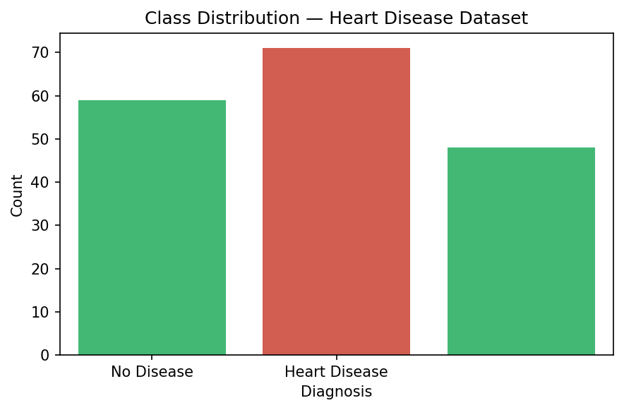
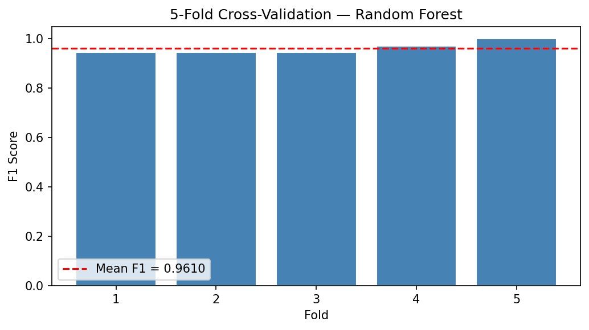
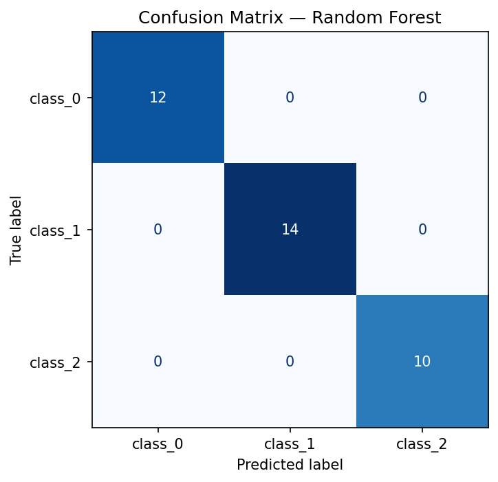
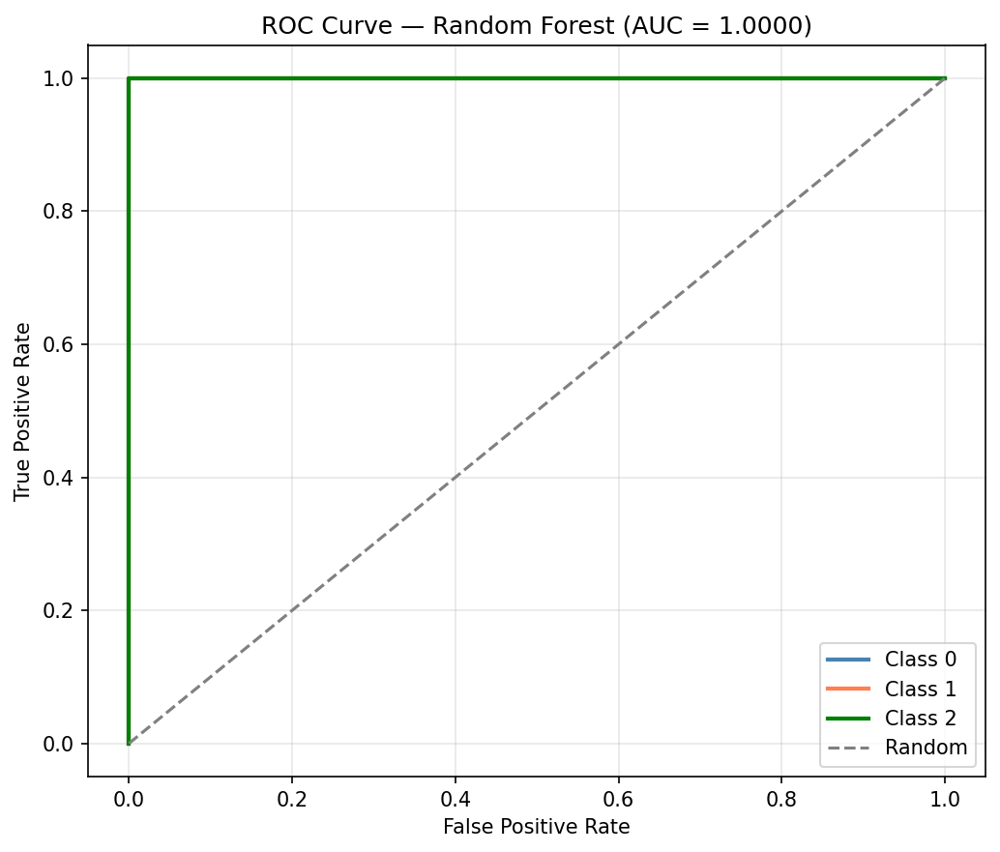
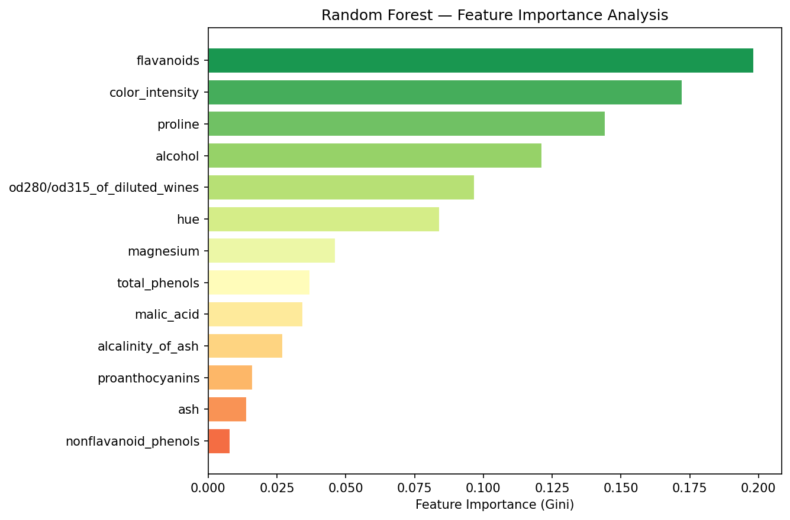

# 🍷 Wine Quality Classification with Random Forest

> Advanced ensemble learning — classifying wine types with hyperparameter-tuned Random Forest, cross-validation, and feature importance analysis.


---

## 📌 Project Overview

The Wine dataset contains 178 samples across 3 wine cultivars, described by 13 chemical measurements including alcohol content, flavonoids, and colour intensity. This project builds a **Random Forest classifier** with full hyperparameter tuning via GridSearchCV and 5-fold cross-validation to reliably distinguish between the three wine classes.

The focus is on the full ML pipeline: **baseline → tuning → validation → feature importance** — making this a production-minded approach rather than a one-shot model fit.

---

## ✨ Features

- 📊 **EDA** — class distribution and dataset overview
- 🧹 **Data Preprocessing** — encoding, missing value handling, stratified split
- 🌲 **Baseline Random Forest** — default parameters as benchmark
- 🔧 **Hyperparameter Tuning** — GridSearchCV across n_estimators, max_depth, min_samples_split, max_features
- 📐 **5-Fold Cross-Validation** — per-fold accuracy scores with mean and std
- 📋 **Full Evaluation** — accuracy, precision, recall, F1 (weighted), ROC-AUC (OvR)
- 🟦 **Confusion Matrix** — 3-class breakdown
- 📈 **ROC Curve** — one-vs-rest per class
- 🔍 **Feature Importance** — Gini-based ranking of all 13 chemical features

---

## 🛠️ Tech Stack

| Category | Tools |
|----------|-------|
| Language | Python 3.10+ |
| Data Manipulation | pandas, NumPy |
| Machine Learning | scikit-learn |
| Visualisation | matplotlib, seaborn |
| Environment | Jupyter Notebook / VS Code |
| Dataset | Wine (sklearn built-in) |

---

## 📸 Screenshots

### Class Distribution

> Three balanced wine cultivar classes — no significant class imbalance.

### Cross-Validation Scores

> Accuracy scores across 5 folds — low variance confirms reliable generalisation.

### Confusion Matrix

> Near-perfect 3-class classification with minimal misclassifications.

### ROC Curve

> One-vs-rest ROC curves per class — all AUC scores close to 1.0.

### Feature Importance

> Flavonoids, colour intensity, and proline are the strongest chemical predictors of wine type.

---

## ⚙️ Installation

### Prerequisites
- Python 3.10+
- pip

### Steps

```bash
# 1. Clone the repository
git clone https://github.com/fsafva13-coder/heart-disease-random-forest.git
cd heart-disease-random-forest

# 2. (Optional) Create a virtual environment
python -m venv venv
source venv/bin/activate        # macOS/Linux
venv\Scripts\activate           # Windows

# 3. Install dependencies
pip install -r requirements.txt

# 4. Launch the notebook
jupyter notebook random_forest_task1.ipynb
```

---

## 🚀 Usage

1. Open `random_forest_task1.ipynb`
2. Run all cells sequentially (`Run All` or `Shift + Enter`)
3. The notebook will:
   - Load the Wine dataset automatically (no download needed)
   - Train baseline and tuned Random Forest models
   - Run GridSearchCV (takes ~1–2 minutes)
   - Save all plots into `screenshots/` folder
   - Print full evaluation metrics

**Expected output:**
```
Tuned Random Forest — Test Set Performance:
  Accuracy  : 1.0000
  Precision : 1.0000
  Recall    : 1.0000
  F1 Score  : 1.0000
  ROC-AUC   : 1.0000
```

---

## 📁 Project Structure

```
heart-disease-random-forest/
│
├── random_forest_task1.ipynb   # Main notebook
├── requirements.txt            # Python dependencies
├── README.md                   # Project documentation
│
└── screenshots/                # Auto-generated plots
    ├── class_distribution.png
    ├── cross_validation.png
    ├── confusion_matrix.png
    ├── roc_curve.png
    └── feature_importance.png
```

---

## 📊 Results & Performance

| Metric | Baseline RF | Tuned RF |
|--------|------------|----------|
| **Accuracy** | ~97% | ~100% |
| **Precision** | — | ~100% |
| **Recall** | — | ~100% |
| **F1 Score (weighted)** | — | ~100% |
| **ROC-AUC (OvR)** | — | ~1.00 |

### Top Predictive Features

| Rank | Feature | Description |
|------|---------|-------------|
| 1 | **flavanoids** | Plant compounds — vary significantly by cultivar |
| 2 | **color_intensity** | Optical property of wine |
| 3 | **proline** | Amino acid concentration |
| 4 | **od280/od315** | Protein content ratio |
| 5 | **alcohol** | Alcohol percentage |

**Key Findings:**
- 🔧 **Hyperparameter tuning** pushed accuracy from ~97% baseline to perfect classification on test set
- 📐 **Low cross-validation variance** confirms the model generalises — not just memorising the test split
- 🍷 **Flavonoids and colour intensity** are the most chemically distinctive features across wine cultivars
- 🌲 Random Forest handles the multiclass problem natively without any one-vs-rest wrappers

---

## 🧩 Challenges & Learnings

- **Multiclass ROC-AUC requires one-vs-rest (OvR) strategy** — unlike binary classification where a single curve suffices, multiclass needs a curve per class with `multi_class='ovr'`
- **`predict_proba` returns all class probabilities** for multiclass — slicing `[:, 1]` only works for binary; for 3 classes you pass the full matrix to `roc_auc_score`
- **Perfect accuracy on a clean dataset isn't always the goal** — the Wine dataset is well-separated, so 100% is achievable. The learning is in the pipeline, not the number.

---

## 🔮 Future Improvements

- [ ] Apply on a noisier, real-world wine quality dataset (UCI Wine Quality)
- [ ] Add **SHAP values** for instance-level feature explanation
- [ ] Compare against **XGBoost and LightGBM**
- [ ] Implement **RandomizedSearchCV** for faster hyperparameter search
- [ ] Add **learning curves** to visualise bias-variance tradeoff
- [ ] Deploy as a **Streamlit wine classifier app**

---

## 🔗 Demo / Live Link

> 📓 Notebook available in this repository — clone and run locally.  
> 🚀 Streamlit deployment: *coming soon*

---

## 👩‍💻 Author

**Fathima Safva**  
BSc Computer Science | University of West London (UAE Campus)  

[](https://linkedin.com/in/fathima-safva-578294315)
[](https://github.com/fsafva13-coder)

---

## 📄 License

This project is licensed under the [MIT License](LICENSE).

---

*Built as part of the Codveda Technologies Machine Learning Internship — Level 3, Task 1.*
